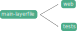

# Advanced workflows

## Intro
Layerfiles can be composed into arbitrarily powerful workflows.

Consider these three Layerfiles:

### 1. Layerfile at (repo root)/Layerfile
```Layerfile
FROM vm/ubuntu:18.04
RUN apt-get update && apt-get install postgresql python3
```

### 2. Layerfile at (repo root)/web/Layerfile
```Layerfile
FROM /Layerfile
COPY . .
RUN ./unittest.sh
```

### 3. Layerfile at (repo root)/web/tests/Layerfile
```Layerfile
FROM /Layerfile
COPY .. .
RUN BACKGROUND ./start-webserver.sh
RUN ./e2etests.sh
EXPOSE WEBSITE localhost:8080
```


When commited to a repository, they will create the following execution graph, where each node is created by a layerfile:



Here, LayerCI has searched for files named 'Layerfile', discovered all three of these files, and linked them based on their parents (look at the FROM lines)

## Ramifications of inheritance using 'FROM'

Beyond just ensuring that actions occur sequentially, `FROM` also shares files and processes between parents and children.

Layerfile 1 installs `python3` here, and installs (and starts) a postgres instance, which means that layerfiles #2 and #3 both get a distinct copy of the database.